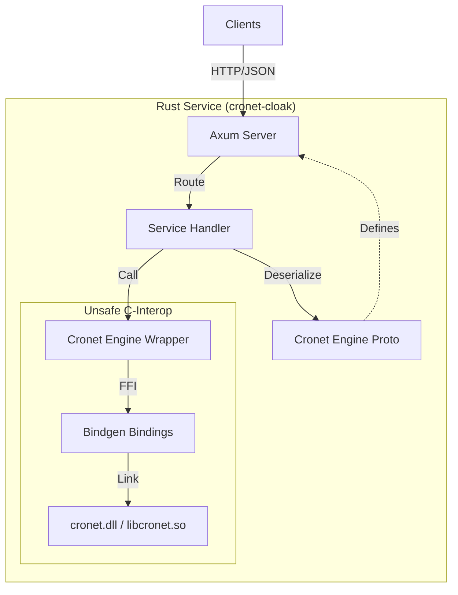

```mermaid
graph TD
    User[Clients] -->|HTTP/JSON| API[Axum Server]
    
    subgraph "Rust Service (cronet-cloak)"
        API -->|Route| Handler[Service Handler]
        Handler -->|Deserialize| Proto[Cronet Engine Proto]
        Handler -->|Call| Engine[Cronet Engine Wrapper]
        
        subgraph "Unsafe C-Interop"
            Engine -->|FFI| Bindings[Bindgen Bindings]
            Bindings -->|Link| Lib[cronet.dll / libcronet.so]
        end
    end

    Proto -.->|Defines| API
```
